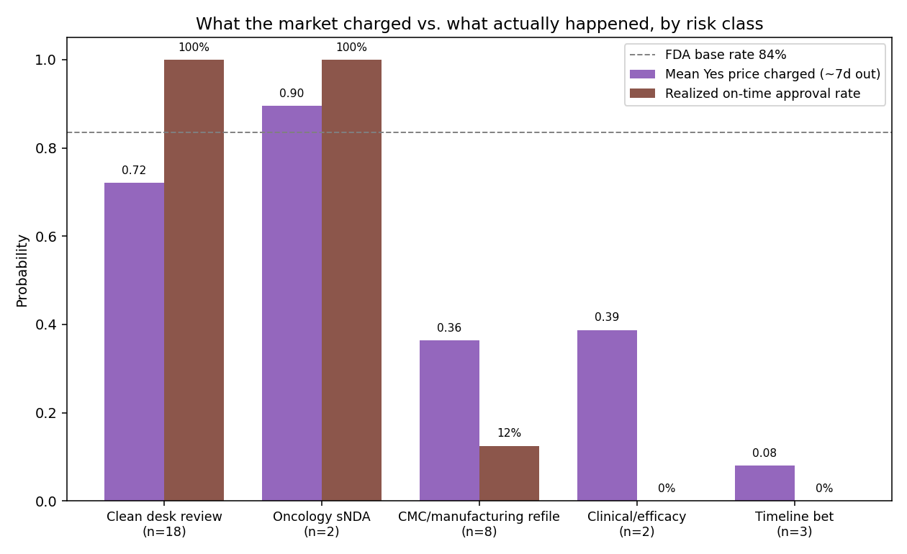
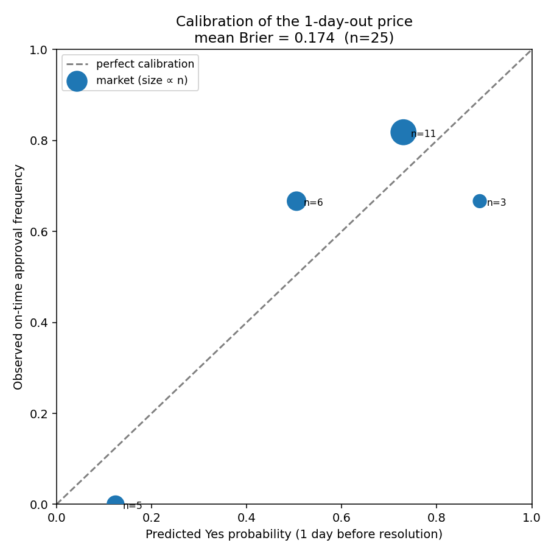
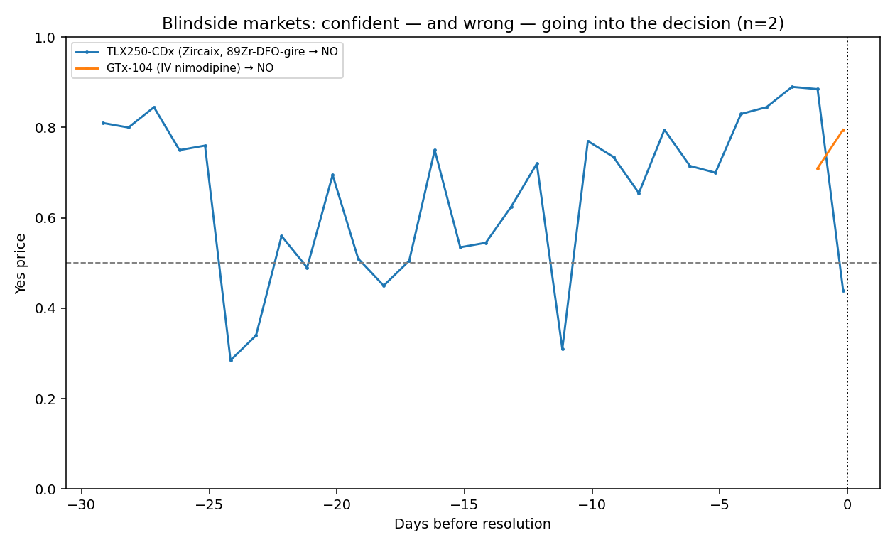
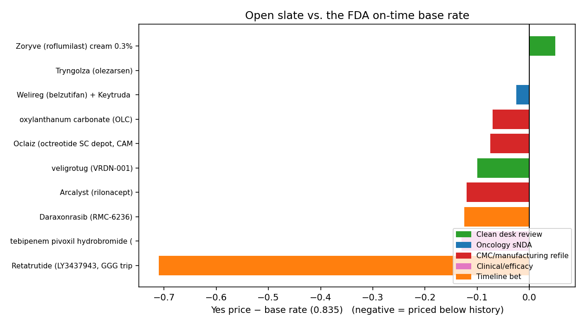
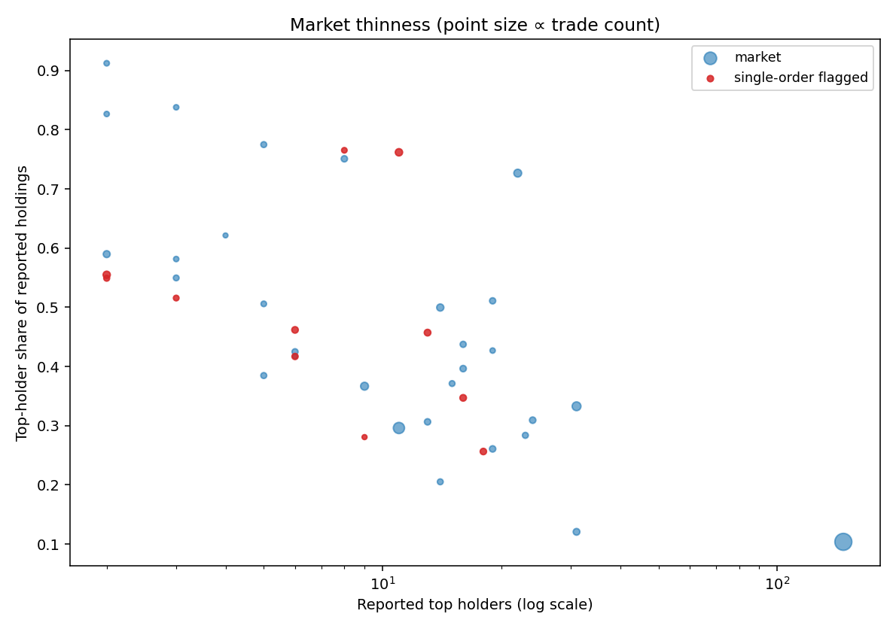

# fda-markets

A reproducible pipeline that collects every **FDA drug-approval prediction
market** on Polymarket (open and resolved), pulls their full price histories,
attaches hand-researched regulatory metadata, and computes calibration / surprise
metrics — so the market's forecasting accuracy and risk mis-pricing can be analyzed.

All data comes from **public Polymarket APIs (no key, no auth)** plus a
web-researched regulatory-enrichment layer with a cited source for every value.

## Pipeline

```
fetch_markets.py     →  fda_markets_raw.csv          (Gamma API: fda + drug tags, open + closed)
build_enrichment.py  →  enrichment.csv               (from enrichment_data.json — cited regulatory facts)
enrich_markets.py    →  fda_markets_enriched.csv      (raw + regulatory metadata, joined on slug)
process_markets.py   →  fda_markets_processed.csv     (+ price histories + computed metrics)
summary.py           →  console summary + findings
make_figures.py      →  figures/*.png                 (analysis charts)
```

Run it end to end:

```bash
pip install -r requirements.txt        # pandas requests tqdm matplotlib
python fetch_markets.py
python build_enrichment.py
python enrich_markets.py
python process_markets.py              # caches price series; pass --refresh to re-download
python summary.py
python make_figures.py                 # writes PNGs to figures/
```

`process_markets.py` reads `fda_markets_enriched.csv` if present (else the raw
file with `--raw`). It caches each price series to disk, so re-runs and the
reproducibility check don't re-hit the API; use `--refresh` to force a re-pull.

## Outputs

| File | Contents |
|---|---|
| `fda_markets_raw.csv` | One row per market straight from Gamma (prices, tokens, volume, dates, `context_description`). |
| `fda_markets_enriched.csv` | Raw + 22 regulatory fields (sponsor, PDUFA, application type, prior-CRL + reason class, designations, outcome, eventual approval, source URLs). |
| `fda_markets_processed.csv` | The **analysis-ready** file: enriched rows + calibration/surprise/single-order/depth metrics. Full 74-column data dictionary in [methodology.md](methodology.md#7-column-dictionary--fda_markets_processedcsv). |
| `price_history/<slug>.csv` | Daily (1440-min) Yes-price series, full life of each market. |
| `price_history_fine/<slug>.csv` | 10-min series for sharp movers (single-order detection). |
| `market_depth.csv` | Per-market liquidity/concentration from `/trades`+`/holders` (trades, unique traders, largest trade, top holders, top-holder %). |
| `figures/*.png` | Analysis charts from `make_figures.py` (see **Figures** below). |
| `enrichment_data.json` | Source of the enrichment layer — cited, with research notes. |
| `methodology.md` | Field definitions, resolution semantics, base rate, caveats. |

## Figures

`python make_figures.py` reads `fda_markets_processed.csv` + the `price_history/`
series and writes these PNGs to `figures/`.

**The mis-pricing, in one chart** — what the market charged ~7 days out vs. what
actually happened, by regulatory risk class. Clean first-cycle reviews were
*under*-priced (0.72 → approved 100% of the time, n=18); CMC/manufacturing-gated
reviews were charged 0.36 but approved on time only **1 of 8 times (12.5%)**:



**Calibration of the 1-day-out price** — predicted Yes probability vs. observed
approval frequency (mean Brier ≈ 0.136):



**Blindsides** — markets that were confident *and wrong* going into the decision
(e.g. TLX250 riding ~80% into a CRL; Ketamine sitting ~20% before a surprise
approval), aligned to days-before-resolution:



**Open slate vs. the base rate** — current Yes price minus the 0.835 FDA on-time
base rate, colored by risk category (negative = priced below history):



**Market thinness** — top-holder concentration vs. reported holder count, point
size ∝ trade count, single-order moves highlighted:



## Data sources (all public)

1. **Gamma — events** `https://gamma-api.polymarket.com/events?tag_slug={fda|drug}&closed={true|false}&limit=8&offset={N}&order=endDate&ascending=false`
   Paged at `limit=8` (large event payloads truncate at higher limits). Both
   `fda` and `drug` tags, both states, de-duped by event `id`.
2. **Gamma — single event** `…/events?slug={slug}` — small payload, used for clean re-pulls and QA spot-checks.
3. **CLOB — price history** `https://clob.polymarket.com/prices-history?market={YES_TOKEN_ID}&interval=max&fidelity={min}` — daily (`1440`) for every market; 10-min (`10`) for flagged sharp movers.
4. **Data API** `https://data-api.polymarket.com/trades` and `/holders` — available for single-trader confirmation of suspected single-order moves.

## Scope filter

We keep only per-drug contracts whose title starts with **"FDA approves"**.
This excludes non-drug FDA markets ("next FDA commissioner", "FDA revokes polio
vaccine", the grouped "FDA approvals in July" event). The thematic
**"FDA approves a psychedelic for medical use in 2026"** market is kept in the
dataset but **excluded from the drug-by-drug base rate** — it resolved Yes on a
substance-list technicality (see `methodology.md`).

## Headline result

Splitting resolved markets by regulatory risk class exposes a sharp gradient
(mean Yes price the market charged ~7 days before resolution vs. the realized
on-time approval rate):

| risk_category | mean price charged | on-time approval rate |
|---|---|---|
| Clean desk review | 0.72 | **18 / 18 = 100%** |
| Oncology sNDA | 0.90 | 2 / 2 = 100% |
| CMC/manufacturing refile | 0.36 | **1 / 8 = 12.5%** |
| Clinical/efficacy | 0.39 | 0 / 2 = 0% |
| Timeline bet | 0.08 | 0 / 3 = 0% |

Clean first-cycle reviews approved on time every time; CMC-gated reviews almost
never did. Of the 8 resolved CRLs, **6 were CMC/manufacturing-driven** (only
Capricor and PTC's vatiquinone were efficacy CRLs) — manufacturing, not data, is
what sinks these.

**The sharper thread — the market may be forgetting its own lesson.**
Historically the market priced CMC/manufacturing refiles at ~0.36 and they
approved on time just **1 of 8 times (12.5%)** — and the two it priced
*confidently high* (TLX250 at ~0.80, GTx-104 at ~0.71) both took CRLs. Yet the
**three open CMC refiles sit at 0.72–0.77** (Oclaiz, Arcalyst, Unicycive's OLC) —
more than double the historical average, priced as if that 12.5% track record
didn't exist. Caveats: small n (8), and each open refile may genuinely have fixed
its specific CMC issue — but the base rate says be skeptical. (CMC problems are
usually *curable* — 2 of the 8 were eventually approved, 6 resubmitted and
pending — just rarely on the market's by-this-date timeline, which is exactly why
these contracts resolve No.)

**A clean within-drug case study:** Unicycive's oxylanthanum carbonate appears
twice — the 2025 market resolved No on a single-deficiency CMC CRL; the 2026
market is the *refile* of the same drug, still pending. Same molecule, two
cycles.

> Data snapshot: 2026-06-09 (open-market prices re-pulled at write time). Markets
> resolve continuously, so re-running picks up newly resolved contracts and
> updated prices. Every regulatory classification above is verified against
> primary sources cited in `enrichment_data.json`.
